# 课程说明：

* 体验课内容节选自[《2025大模型Agent智能体开发实战》](https://whakv.xetslk.com/s/1tKbjV)完整版付费课程

  体验课时间有限，若想深度学习大模型技术，欢迎大家报名由我主讲的[《2025大模型Agent智能体开发实战》](https://whakv.xetslk.com/s/1tKbjV)：

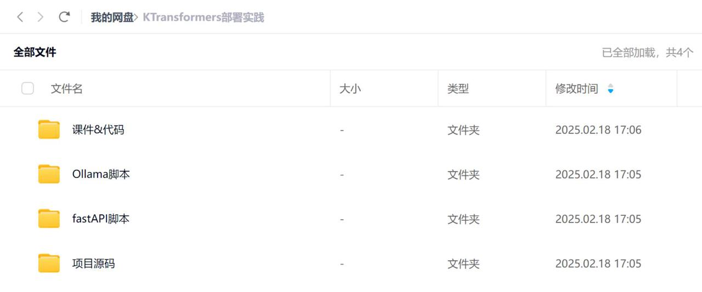


此外，公开课全套学习资料，已上传至网盘（ https://pan.baidu.com/s/1x\_IkUBh6B5oNHx62Epwgrw?pwd=g2g3 ）

**需要更系统深入学习大模型可扫码⬆️添加助教咨询喔～**

***

# KTransformer高性能部署DeepSeek R1满血版模型

## 一、DeepSeek R1部署方案综述

### 1. DeepSeek R1高性能部署方案介绍

&#x20;       伴随着DeepSeek R1模型使用需求不断深化，如何才能部署更高性能的满血版DeepSeek R1模型，就成了很多应用场景下的当务之急。受限于DeepSeek R1 671B（6710亿参数）的模型规模，通常情况下部署DeepSeek R1满血版模型需要1200G左右显存（考虑百人内并发情况），需要双节点8卡A100服务器才能运行（总成本约在260万-320万左右），而哪怕是INT 4半精度下，也需要至少490G显存，需要单节点8卡A100服务器才能运行。

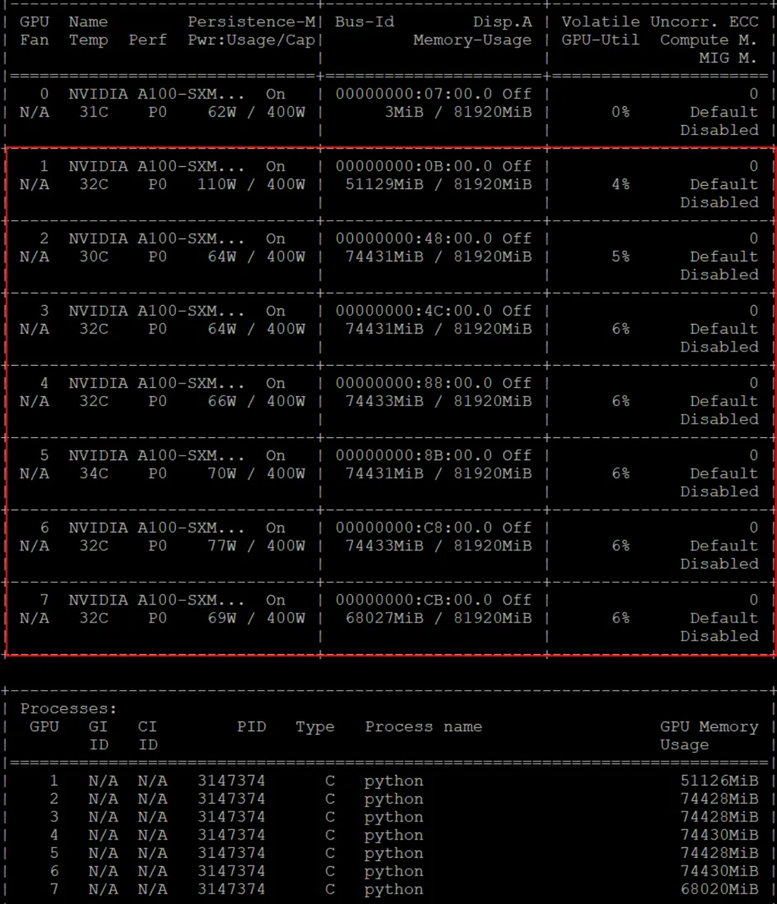

在此情况下，如何以更少的成本获得尽可能好的模型性能——也就是如果进行DeepSeek R1的高性能部署，就成了重中之重。基本来说，目前的解决方案有以下三种：

1. **采用“强推理、若训练”的硬件配置**：如选择国产芯片、或者采购DeepSeek一体机、甚至是选择MacMini集群等，都是不错的选择。这些硬件模型训练性能较弱，但推理能力强悍，对于一些不需要进行模型训练和微调、只需要推理（也就是对话）的场景来说，是个非常不错的选择。例如45万左右成本，就能购买能运行DeepSeek R1满血版模型的Mac Mini集群，相比购买英伟达显卡，能够节省很大一部分成本。但劣势在于Mac M系列芯片并不适合进行模型训练和微调。


1. **采用DeepSeek R1 Distill蒸馏模型**：DeepSeek R蒸馏模型组同样推理性能不俗，且蒸馏模型尺寸在1.5B到70B之间，可以适配于任何硬件环境和各类不同的使用需求。


1. 其中各蒸馏模型、各量化版本、各不同使用场景（如模型推理、模型高效微调和全量微调）下模型所需最低配置如下：


1. \*\*采用KTransformers（Quick Transformers）技术：\*\*这是一项由清华大学团队提出的，可以在模型运行过程中灵活的将专家模型加载到CPU上、同时将MLA/KVCache卸载到GPU上，从而深度挖掘硬件性能，实现更低的显存运行更大尺寸的模型。

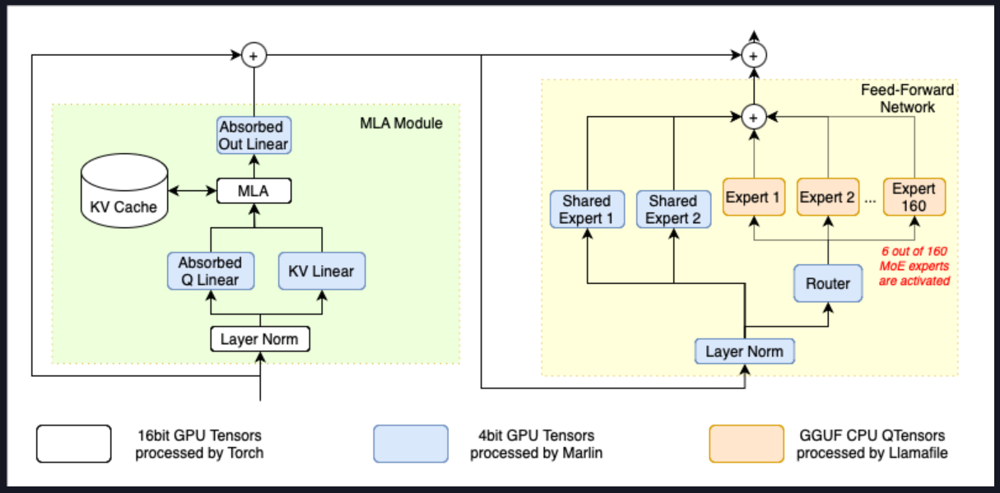

1. 该技术目前的实践效果，可以实现480G内存+13G显存（长尺寸输出或多并发时达到20G显存），即可运行DeepSeek R1 Q\_4\_K\_M量化版模型（类似INT4量化），并且响应速度能够达到15token/s。大幅降低了传统DeepSeek R1 INT4模型的运行门槛。这也是目前最具价值的DeepSeek R1高性能部署方案。

   * GitHub主页：https://github.com/kvcache-ai/ktransformers

   

2. 传统情况下，8卡 A100 GPU服务器才能运行DeepSeek R1 INT4模型，成本接近200万。而480G内存+单卡4090服务器，总成本不到5万。

3. \*\*采用Unsloth动态量化技术：\*\*此外，还可以考虑采用Unsloth的动态量化方案。不同于KT将不同的专家加载到CPU上，通过内存分担显存的方法保证R1 Q4KM模型运行，作为资深量化专家团队，Unsloth团队的技术方案则是在确保模型性能的基础上，更深度的进行模型量化（最多量化到1.58Bit），并且执行不同任务时将激活的专家加载到GPU上，从而压缩模型运行所需硬件条件。


1. 该技术能够实现单卡24G显存运行1.58bit到2.51bit的DeepSeek R1模型，并且提供了一整套动态方案，支持从单卡24G到双卡80G服务器运行动态量化的R1模型，并且对于内存和CPU没有任何要求。


1. 通常意义下量化程度越深，模型效果越差，但由于Unsloth出色的技术能力，导致哪怕是1.58bit量化情况下，量化模型仍能拥有大部分原版模型的能力。


* Unsloth主页：https://unsloth.ai/


本节公开课我们将重点介绍KTransformers方案的部署流程，实现在单卡4090+480G内存服务器上部署并调用DeepSeek R1满血版模型，并介绍如何使用KTransformers+FastAPI封装OpenAI风格的API，并将其与Open-WebUI进行集成。

**若大家对Unsloth方案也感兴趣，可以在视频下方留言，我将根据大家的反馈决定是否继续讲解Unsloth方案实践流程。**

### 2. 实验服务器配置说明

本次公开课服务器配置如下：

* 深度学习环境：PyTorch 2.5.1、Python 3.12(ubuntu22.04)、Cuda 12.4

* 硬件环境：

  * **GPU**：RTX 4090(24GB) \* 4（实际只使用一张GPU）

  * **CPU**：64 vCPU Intel(R) Xeon(R) Gold 6430

  * **内存**：480G（至少需要382G）

  * **硬盘**：1.8T（实际使用需要380G左右）

KTransformer项目部署硬件配置方面需要注意如下事项：

* GPU对实际运行效率提升不大，单卡3090、单卡4090、或者是多卡GPU服务器都没有太大影响，只需要留足20G以上显存（最小可行性实验的话只需要14G显存）即可；

* 若是多卡服务器，则可以进一步尝试手动编写模型权重卸载规则，使用更多的GPU进行推理，可以一定程度减少内存需求，但对于实际运行效率提升不大。最省钱的方案仍然是单卡GPU+大内存配置；

* KTransformer目前开放了V2.0、V2.1和V3.0三个版本（V3.0目前只有预览版，只支持二进制文件下载和安装），其中V2.0和V2.1支持各类CPU，但从V3.0开始，只支持AMX CPU，也就是最新几代的Intel CPU。这几个版本实际部署流程和调用指令没有任何区别，公开课以适配性最广泛的V2.0版本进行演示，若当前CPU支持AMX，则可以考虑使用V3.0进行实验，推理速度会大幅加快。

* CPU AMX（Advanced Matrix Extensions）是Intel在其Sapphire Rapids系列处理器中推出的一种新型硬件加速指令集，旨在提升矩阵运算的性能，尤其是针对深度学习和人工智能应用。

* 可以考虑在AutoDL上租赁4卡4090服务器，480G内存，约14元每小时。

### 3. 参考资料与课件领取

公开课全套代码课件、以及项目源码和自定义的脚本，都已上传至”赋泛大模型技术社区“


👆扫码即可领取全部课程资料👆&#x20;


其他更多相关参考资料

* 《DeepSeek R1本地部署流程》https://www.bilibili.com/video/BV19kFoe6Ef7/


* 《AutoDL快速入门》：https://www.bilibili.com/video/BV1bxB7YYEST/


## 二、KTransformers入门介绍与基础环境搭建

### 1.KTransformers项目入门介绍

#### 1.1 项目定位

KTransformers（发音为“Quick Transformers”）旨在通过先进的内核优化和计算分布/并行化策略来增强你使用Transformers的体验。

KTransformers 是一个灵活、以 Python 为中心的框架，其核心设计理念是可扩展性。用户仅需一行代码，即可实现优化模块的集成，并享受到以下特性：

* **与 Transformers 兼容的接口**

* **符合 OpenAI 和 Ollama 规范的 RESTful API**

* **一个简化版的 ChatGPT 风格 Web UI**（最新版已弃用）

项目定位将 KTransformers 打造成一个灵活的平台，供用户探索和实验创新的大模型推理优化技术。因此，项目支持编写自定义脚本来实现模型权重的灵活卸载。

#### 1.2 项目参考资料

* GitHub主页：https://github.com/kvcache-ai/ktransformers

* 项目使用指南：https://kvcache-ai.github.io/ktransformers/index.html

#### 1.3 KTransformers支持的模型及运行方式

* **KT支持的模型类型：**

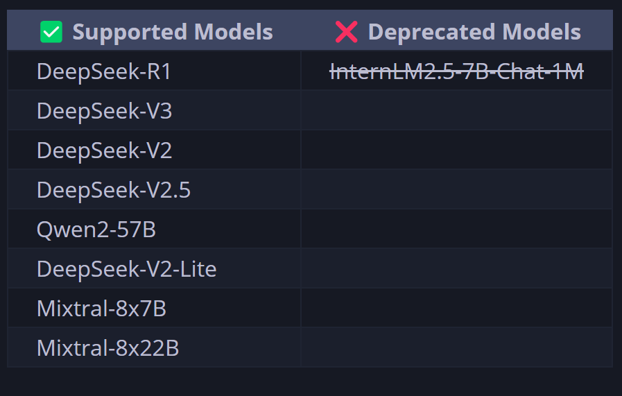

* **KT支持的量化形式**


* **不同模型所需运行条件**

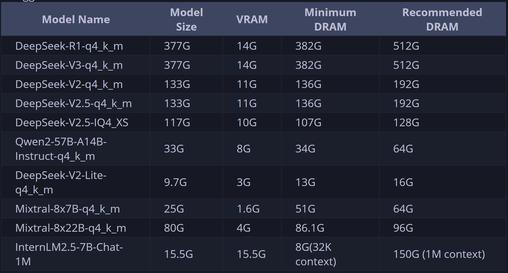

#### 1.4 KTransformers部署方法

&#x20;       KTransformers支持在Windows、Linux等操作系统下，使用源码部署或者docker工具进行部署。考虑到更为一般的企业级应用场景，本次实验采用Linux系统作为基础环境进行演示，并采用源码部署的方法进行部署。

### 2.DeepSeek R1模型权重与配置文件下载

&#x20;       本次实验使用官方推荐的DeepSeek R1 Q4\_K\_M，直接使用Unsloth压制的模型即可（此外也可以自己使用llama.cpp进行模型压缩），模型下载地址：

* 魔搭社区下载地址：https://www.modelscope.cn/models/unsloth/DeepSeek-R1-GGUF


* HuggingFace下载地址：https://huggingface.co/unsloth/DeepSeek-R1-GGUF


模型权重较大，总共约350G左右。若使用AutoDL，最快下载方法是开启学术加速并从Huggingface上进行下载。

下载流程如下：

* 安装huggingface\_hub：

* 在命令行中输入

```bash
pip install huggingface_hub
```


* 【可选】借助screen持久化会话

* 由于实际下载时间可能持续4-6个小时，因此最好使用screen开启持久化会话，避免因为关闭会话导致下载中断。

```bash
screen -S kt
```

* 创建一个名为kt的会话。之后哪怕关闭了当前会话，也可以使用如下命令

```bash
screen -r kt
```

* 若未安装screen，可以使用`sudo apt install screen`命令进行安装。

* 【可选】修改huggingface默认下载路径

* 在默认情况下，Huggingface会将下载文件保存在/root/.cache文件夹中，若想更换默认下载文件夹，则可以按照如下方式修改环境变量，或者在下载代码中设置下载路径。

* 首先在`/root/autodl-tmp`下创建名为`HF_download`文件夹作为huggingface下载文件保存文件夹（具体文件夹名称和地址可以自选）：

```bash
cd /root/autodl-tmp
mkdir HF_download
```


* 然后找到root文件夹下的`.bashrc`文件

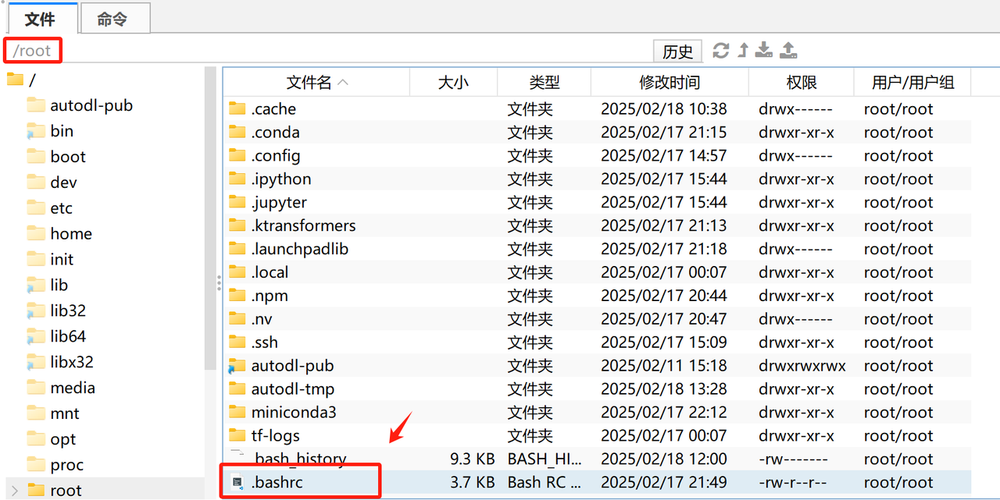

* 在结尾处加上`export HF_HOME="/root/autodl-tmp/HF_download"`


* 保存退出，输入

```bash
source ~/.bashrc
```

* 使环境变量生效。

* 下载模型权重

* 启动Jupyter

```bash
jupyter lab --allow-root
```

* 然后在开启的Jupyter页面中输入如下Python代码：

```python
# 开启学术加速
import subprocess
import os

result = subprocess.run('bash -c "source /etc/network_turbo && env | grep proxy"', shell=True, capture_output=True, text=True)
output = result.stdout
for line in output.splitlines():
    if '=' in line:
        var, value = line.split('=', 1)
        os.environ[var] = value
```

```python
# 下载模型权重，只下载Q4_K_M部分权重
from huggingface_hub import snapshot_download
snapshot_download(
  repo_id = "unsloth/DeepSeek-R1-GGUF",
  local_dir = "DeepSeek-R1-GGUF",      
  allow_patterns = ["*Q4_K_M*"],
)
```

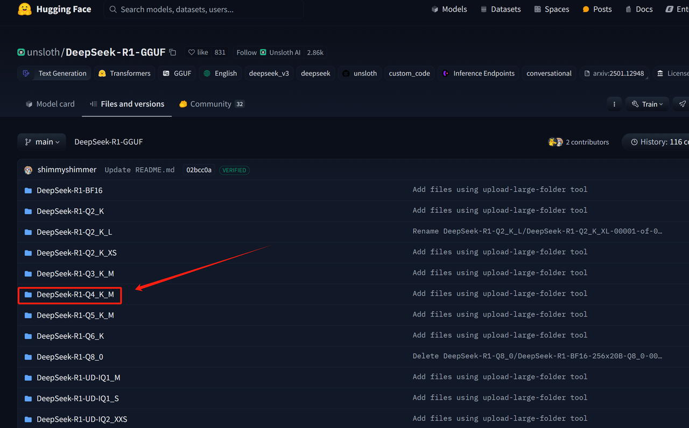

* &#x20;

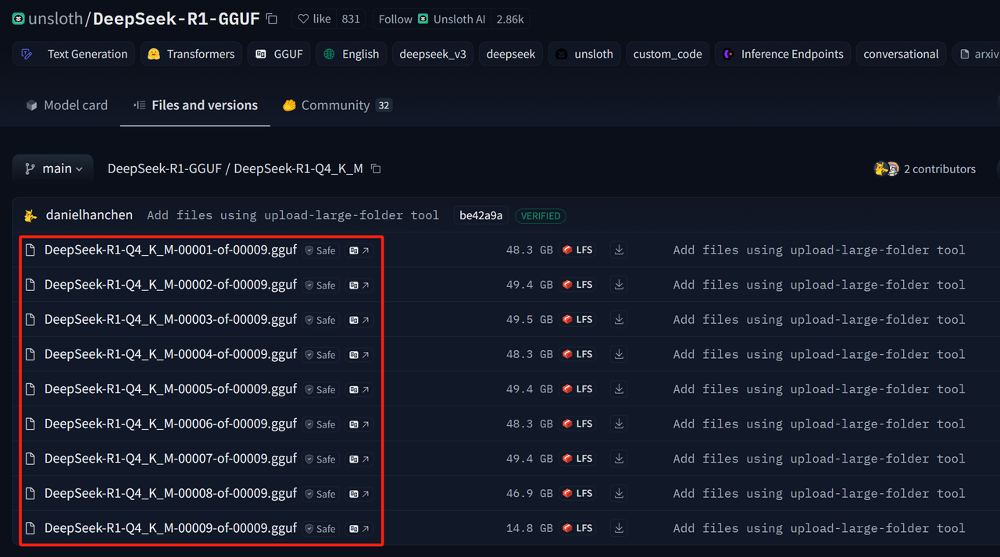

* 完成下载数个小时，下载过程需要持续启动Jupyter服务，其中如果出现下载中断，重新运行下载代码即可继续下载。


* 然后即可在`/root/autodl-tmp/DeepSeek-R1-GGUF/DeepSeek-R1-Q4_K_M`中看到下载的GGUF格式模型权重：

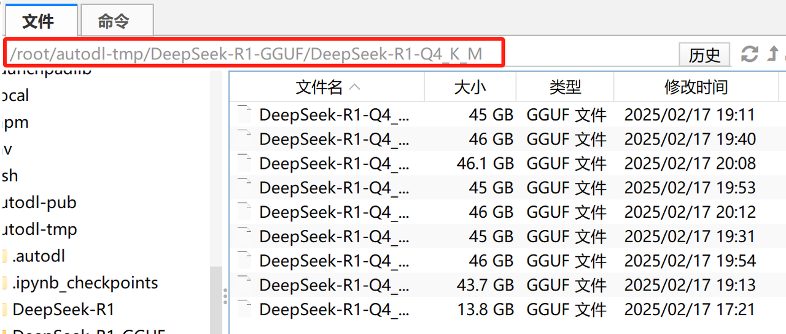

* 【其他方案】使用魔搭社区进行下载

* 若是使用modelscope进行权重下载，则需要先安装魔搭社区

```bash
pip install modelscope
```

* 然后输入如下命令进行下载

```bash
modelscope download --model unsloth/DeepSeek-R1-GGUF  --include '**Q4_K_M**'  --local_dir /root/autodl-tmp/DeepSeek-R1-GGUF
```


* 下载DeepSeek R1原版模型的配置文件

* 此外，根据KTransformer的项目要求，还需要下载DeepSeek R1原版模型的除了模型权重文件外的其他配置文件，方便进行灵活的专家加载。因此我们还需要使用modelscope下载DeepSeek R1模型除了模型权重（.safetensor）外的其他全部文件，可以按照如下方式进行下载

```bash
mkdie ./DeepSeek-R1

modelscope download --model deepseek-ai/DeepSeek-R1  --exclude '*.safetensors'  --local_dir /root/autodl-tmp/DeepSeek-R1
```


* 下载后完整文件如下所示：


* 相关文件也可以在课程课件中领取：


* 成果汇总

* 这里最终我们是下载了DeepSeek R1 Q4\_K\_M模型权重和DeepSeek R1的模型配置文件，并分别保存在两个文件夹中：

  * DeepSeek R1 Q4\_K\_M模型权重地址：/root/autodl-tmp/DeepSeek-R1-GGUF/DeepSeek-R1-Q4\_K\_M

  

  * DeepSeek R1的模型配置文件地址：/root/autodl-tmp/DeepSeek-R1

  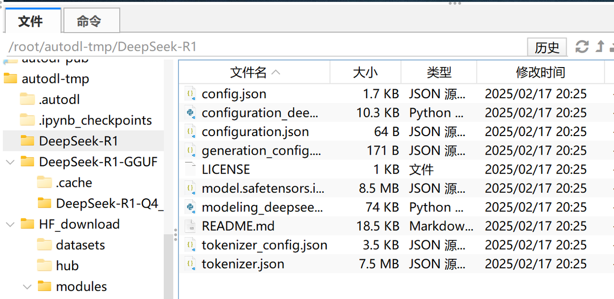

## 三、KTransformer项目部署与调用流程

&#x20;       在准备好了DeepSeek R1 Q4\_K\_M的模型权重和DeepSeek R1模型配置文件之后，接下来开始着手部署KTransformer。该项目部署流程非常复杂，请务必每一步都顺利完成后，再执行下一步。在正式开始安装前，有以下几点需要事先声明：

* 关于版本：目前KT开放了V2.0、V2.1和V3.0预览版。课程以目前兼容性最强的V2.0进行演示，并介绍V3.0部署方法。若CPU满足要求（有AMX功能），则可运行V3.0。

* V3.0版本需求：V3.0对软硬件环境要求较高，除了要求CPU支持AMX功能外，还要求Python 3.11以上及CUDA12.6。

* 项目Bug说明：在顺利实现DeepSeek R1高性能部署前，KT项目并不受关注，因此很多功能处于”年久失修“的状态。如KT宣传的三项功能，transformer API、Server API和Web Server，目前只有transformer API可以兼容DeepSeek R1的高性能部署，因此公开课的后半段，我会手写Server API。并且伴随着目前项目受更多关注，项目也在快速迭代，为了确保能够顺利运行，大家可以使用课程里面配套的项目原版代码+改写的脚本进行运行。**其他版本的KT不确保能否运行成功。**


&#x20;


### 1. 安装基础依赖

首先需要安装**gcc**、**g++** 和 **cmake**等基础库：

```bash
sudo apt-get update
sudo apt-get install gcc g++ cmake ninja-build
```

然后继续安装 **PyTorch**、**packaging**、**ninja**：

```bash
pip install torch packaging ninja cpufeature numpy
```

接下来需要继续安装`flash-attn`

```bash
pip install flash-attn
```

以及需要手动安装`libstdc`

```bash
sudo add-apt-repository ppa:ubuntu-toolchain-r/test
sudo apt-get update
sudo apt-get install --only-upgrade libstdc++6
```

```bash
conda install -c conda-forge libstdcxx-ng
```

### 2. 安装KTransformers

下载KT压缩包：


&#x20;


上传至服务器指定路径`/root/autodl-tmp`，并使用如下命令进行解压缩：

```bash
unzip ktransformers-main.zip
mv ktransformers-main ktransformers
```

然后进行部署，先进行初始化：

```bash
cd ktransformers
git submodule init
git submodule update
```

接下要需要确认当前CPU的类型，如果是双槽版本64核CPU，则需要使用如下命令设置NUMA=1：

```bash
export USE_NUMA=1
```

例如，我当前的服务器CPU为：64 vCPU Intel(R) Xeon(R) Gold 6430


代表的就是64核双槽CPU，这种CPU往往出现在服务器使用场景中。

因此这里需要先输入`export USE_NUMA=1`，然后再执行后续命令。而这里如果不是64核双槽CPU，则无需执行这个命令。而若是64核双槽CPU，但未执行`export USE_NUMA=1`就执行了后续命令，则需要再次输入`export USE_NUMA=1`，然后再次运行后面的命令。

然后即可开始进行项目的安装——运行安装脚本：

```bash
sh ./install.sh
```


&#x20;

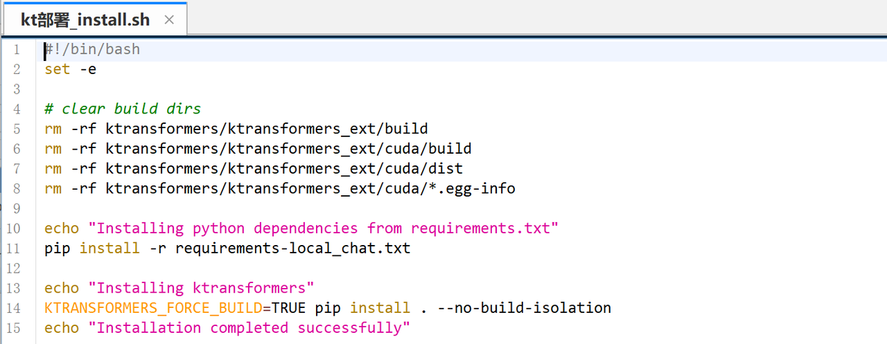

一切安装完成后，即可输入如下命令查看当前安装情况

```bash
pip show ktransformers
```

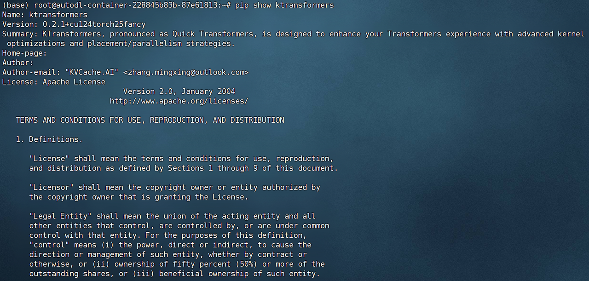

```bash
wget https://github.com/kvcache-ai/ktransformers/releases/download/v0.1.4/ktransformers-0.3.0rc0+cu126torch26fancy-cp311-cp311-linux_x86_64.whl
pip install ./ktransformers-0.3.0rc0+cu126torch26fancy-cp311-cp311-linux_x86_64.whl
```

### 3.运行KTransformer

&#x20;       部署完成后，即可尝试调用KTransformer进行对话。这里可以采用官方提供的最简单的对话脚本`local_chat.py`进行对话：


在项目根目录下输入如下命令：

```bash
python ./ktransformers/local_chat.py --model_path /root/autodl-tmp/DeepSeek-R1 --gguf_path /root/autodl-tmp/DeepSeek-R1-GGUF  --cpu_infer 65 --max_new_tokens 1000 --force_think true
```

参数解释如下：

* `<你的模型路径>` 可以是本地路径，也可以是来自 Hugging Face 的在线路径（如 `deepseek-ai/DeepSeek-V3`）。如果在线出现连接问题，尝试使用镜像站点（如 `hf-mirror.com`）。

* `<你的GGUF路径>` 也可以是在线路径，但由于文件较大，建议下载并量化模型以满足需求（注意，这是目录路径）。

* `--max_new_tokens 1000` 是最大输出token长度。如果发现答案被截断，可以增加该值以获得更长的答案（但请注意，增大会导致OOM问题，并且可能减慢生成速度）。

* `--force_think true`。打印R1模型的思考过程。

* 启动过程

* 需要完整加载61层模型权重


* 开启对话

* 稍等片刻即可开启命令行对话：


* 响应速度


* **提示阶段（prompt eval）**：模型处理了 12 个 token，耗时 2.7385 秒，处理速率为 4.38 个 token 每秒。

* **评估阶段（eval eval）**：模型处理了 62 个 token，耗时 16.0092 秒，处理速率为 3.87 个 token 每秒。

* 由于AutoDL是虚拟化环境进行的运行，性能方面会受影响。

* 显存占用

* 仅占用不到14G显存。

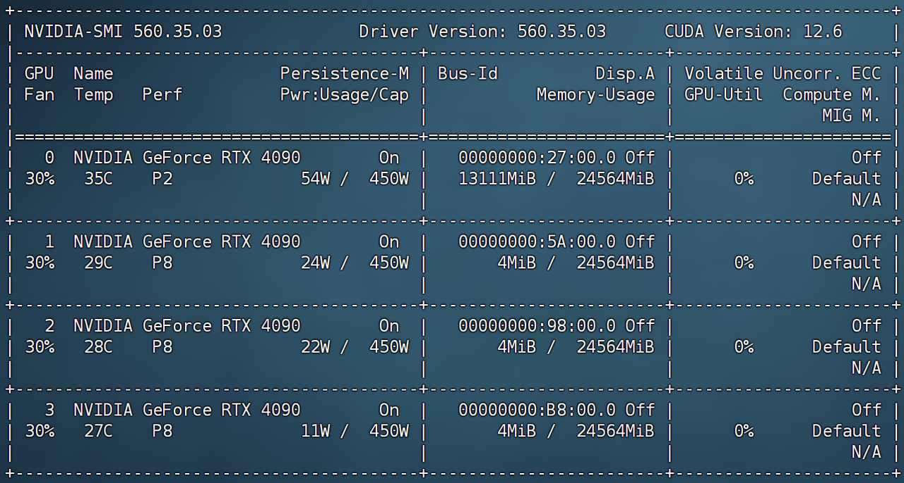

## 四、编写OpenAI风格API调用脚本

### 1. 脚本编写流程

由于官方提供的Restful风格API未及时更新，无法顺利调用KT支持下的R1模型，为了便于开发，我们需要手动编写一个OpenAI风格的API，便于进行代码环境调用与其他开发工作。

我们需要在`/root/autodl-tmp/ktransformers/ktransformers`下创建一个`chat_openai.py`文件：

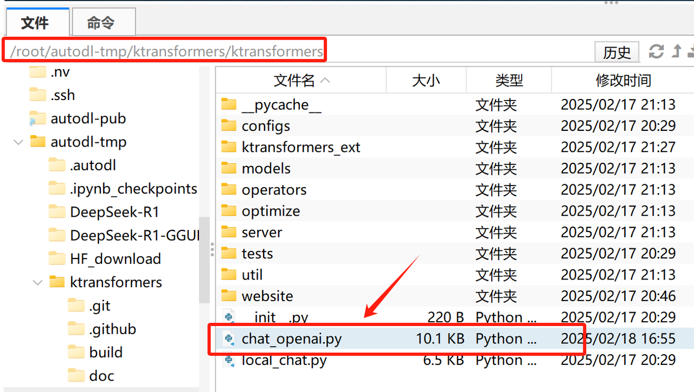

然后写入如下代码：

```python
import argparse
import uvicorn
from typing import List, Dict, Optional, Any
from fastapi import FastAPI, HTTPException, status
from fastapi.middleware.cors import CORSMiddleware
from pydantic import BaseModel
import os
import sys
import time
from fastapi import Request
from fastapi.responses import StreamingResponse, JSONResponse
import json
import logging

# 设置日志记录
logging.basicConfig(level=logging.INFO)
logger = logging.getLogger(__name__)

project_dir = os.path.dirname(os.path.dirname(__file__))
sys.path.insert(0, project_dir)
import torch
from transformers import (
    AutoTokenizer,
    AutoConfig,
    AutoModelForCausalLM,
    GenerationConfig,
    TextStreamer,
)
from ktransformers.optimize.optimize import optimize_and_load_gguf
from ktransformers.models.modeling_deepseek import DeepseekV2ForCausalLM
from ktransformers.models.modeling_qwen2_moe import Qwen2MoeForCausalLM
from ktransformers.models.modeling_deepseek_v3 import DeepseekV3ForCausalLM
from ktransformers.models.modeling_llama import LlamaForCausalLM
from ktransformers.models.modeling_mixtral import MixtralForCausalLM
from ktransformers.util.utils import prefill_and_generate
from ktransformers.server.config.config import Config

custom_models = {
    "DeepseekV2ForCausalLM": DeepseekV2ForCausalLM,
    "DeepseekV3ForCausalLM": DeepseekV3ForCausalLM,
    "Qwen2MoeForCausalLM": Qwen2MoeForCausalLM,
    "LlamaForCausalLM": LlamaForCausalLM,
    "MixtralForCausalLM": MixtralForCausalLM,
}

ktransformer_rules_dir = os.path.join(os.path.dirname(os.path.abspath(__file__)), "optimize", "optimize_rules")
default_optimize_rules = {
    "DeepseekV2ForCausalLM": os.path.join(ktransformer_rules_dir, "DeepSeek-V2-Chat.yaml"),
    "DeepseekV3ForCausalLM": os.path.join(ktransformer_rules_dir, "DeepSeek-V3-Chat.yaml"),
    "Qwen2MoeForCausalLM": os.path.join(ktransformer_rules_dir, "Qwen2-57B-A14B-Instruct.yaml"),
    "LlamaForCausalLM": os.path.join(ktransformer_rules_dir, "Internlm2_5-7b-Chat-1m.yaml"),
    "MixtralForCausalLM": os.path.join(ktransformer_rules_dir, "Mixtral.yaml"),
}

# 全局变量，存储初始化后的模型
chat_model = None

class OpenAIChat:
    def __init__(
        self,
        model_path: str,
        optimize_rule_path: str = None,
        gguf_path: str = None,
        cpu_infer: int = Config().cpu_infer,
        use_cuda_graph: bool = True,
        mode: str = "normal",
    ):
        torch.set_grad_enabled(False)
        Config().cpu_infer = cpu_infer

        self.tokenizer = AutoTokenizer.from_pretrained(model_path, trust_remote_code=True)
        config = AutoConfig.from_pretrained(model_path, trust_remote_code=True)
        self.streamer = TextStreamer(self.tokenizer, skip_prompt=True) if not Config().cpu_infer else None
        if mode == 'long_context':
            assert config.architectures[0] == "LlamaForCausalLM", "Only LlamaForCausalLM supports long_context mode"
            torch.set_default_dtype(torch.float16)
        else:
            torch.set_default_dtype(config.torch_dtype)

        with torch.device("meta"):
            if config.architectures[0] in custom_models:
                if "Qwen2Moe" in config.architectures[0]:
                    config._attn_implementation = "flash_attention_2"
                if "Llama" in config.architectures[0]:
                    config._attn_implementation = "eager"
                if "Mixtral" in config.architectures[0]:
                    config._attn_implementation = "flash_attention_2"
                model = custom_models[config.architectures[0]](config)
            else:
                model = AutoModelForCausalLM.from_config(
                    config, trust_remote_code=True, attn_implementation="flash_attention_2"
                )

        if optimize_rule_path is None:
            if config.architectures[0] in default_optimize_rules:
                optimize_rule_path = default_optimize_rules[config.architectures[0]]

        optimize_and_load_gguf(model, optimize_rule_path, gguf_path, config)
        
        try:
            model.generation_config = GenerationConfig.from_pretrained(model_path)
        except:
            model.generation_config = GenerationConfig(
                max_length=128,
                temperature=0.7,
                top_p=0.9,
                do_sample=True
            )
        
        if model.generation_config.pad_token_id is None:
            model.generation_config.pad_token_id = model.generation_config.eos_token_id
        
        model.eval()
        self.model = model
        self.use_cuda_graph = use_cuda_graph
        self.mode = mode
        logger.info("Model loaded successfully!")

    def create_chat_completion(
        self,
        messages: List[Dict[str, str]],
        temperature: float = 0.7,
        max_tokens: int = 1000,
        top_p: float = 0.9,
        force_think: bool = False,
    ) -> Dict:
        input_tensor = self.tokenizer.apply_chat_template(
            messages, add_generation_prompt=True, return_tensors="pt"
        )
        
        if force_think:
            token_thinks = torch.tensor([self.tokenizer.encode("<think>\\n", add_special_tokens=False)],
                                        device=input_tensor.device)
            input_tensor = torch.cat([input_tensor, token_thinks], dim=1)

        generation_config = GenerationConfig(
            temperature=temperature,
            top_p=top_p,
            max_new_tokens=max_tokens,
            do_sample=True  # Ensure do_sample is True if using temperature or top_p
        )

        generated = prefill_and_generate(
            self.model,
            self.tokenizer,
            input_tensor.cuda(),
            max_tokens,
            self.use_cuda_graph,
            self.mode,
            force_think
        )

        # Convert token IDs to text
        generated_text = self.tokenizer.decode(generated, skip_special_tokens=True)

        return {
            "choices": [{
                "message": {
                    "role": "assistant",
                    "content": generated_text
                }
            }],
            "usage": {
                "prompt_tokens": input_tensor.shape[1],
                "completion_tokens": len(generated),
                "total_tokens": input_tensor.shape[1] + len(generated)
            }
        }

class ChatMessage(BaseModel):
    role: str
    content: str

class ChatCompletionRequest(BaseModel):
    messages: List[ChatMessage]  # 确保 messages 是 Pydantic 模型实例的列表
    model: str = "default-model"
    temperature: Optional[float] = 0.7
    top_p: Optional[float] = 0.9
    max_tokens: Optional[int] = 1000
    stream: Optional[bool] = False
    force_think: Optional[bool] = True

class ChatCompletionResponse(BaseModel):
    id: str = "chatcmpl-default"
    object: str = "chat.completion"
    created: int = 0
    model: str = "default-model"
    choices: List[Dict[str, Any]]
    usage: Dict[str, int]

app = FastAPI(title="KVCache.AI API Server")

@app.get("/health")
async def health_check():
    return {"status": "healthy"}

@app.middleware("http")
async def add_process_time_header(request: Request, call_next):
    start_time = time.time()
    response = await call_next(request)
    process_time = time.time() - start_time
    response.headers["X-Process-Time"] = f"{process_time:.4f}s"
    return response

app.add_middleware(
    CORSMiddleware,
    allow_origins=["*"],
    allow_credentials=True,
    allow_methods=["*"],
    allow_headers=["*"],
)

@app.post("/v1/chat/completions", response_model=ChatCompletionResponse)
async def chat_completion(request: ChatCompletionRequest):
    try:
        # 如果 messages 是 Pydantic 模型实例列表，使用 model_dump
        messages = [m.model_dump() for m in request.messages]
        response = chat_model.create_chat_completion(
            messages=messages,
            temperature=request.temperature,
            max_tokens=request.max_tokens,
            top_p=request.top_p,
            force_think=request.force_think
        )

        return {
            "id": f"chatcmpl-{int(time.time())}",
            "object": "chat.completion",
            "created": int(time.time()),
            "model": request.model,
            "choices": [{
                "index": 0,
                "message": {
                    "role": "assistant",
                    "content": response['choices'][0]['message']['content']
                },
                "finish_reason": "stop"
            }],
            "usage": response['usage']
        }
    except Exception as e:
        logger.error(f"API Error: {str(e)}")
        raise HTTPException(
            status_code=status.HTTP_500_INTERNAL_SERVER_ERROR,
            detail=f"Internal server error: {str(e)}"
        )

def create_app(model_path: str, gguf_path: str, cpu_infer:int, optimize_rule_path: Optional[str] = None):
    global chat_model
    chat_model = OpenAIChat(
        model_path=model_path,
        gguf_path=gguf_path,
        optimize_rule_path=optimize_rule_path,
        cpu_infer=cpu_infer
    )
    return app

def main():
    parser = argparse.ArgumentParser(description="KVCache.AI API Server")
    parser.add_argument("--model_path", type=str, required=True, help="HuggingFace模型路径")
    parser.add_argument("--gguf_path", type=str, required=True, help="GGUF模型文件路径")
    parser.add_argument("--optimize_rule_path", type=str, help="优化规则文件路径")
    parser.add_argument("--port", type=int, default=8000, help="服务端口号")
    parser.add_argument("--cpu_infer", type=int, default=70, help="使用cpu数量")
    parser.add_argument("--host", type=str, default="0.0.0.0", help="绑定地址")
    args = parser.parse_args()

    create_app(
        model_path=args.model_path,
        gguf_path=args.gguf_path,
        optimize_rule_path=args.optimize_rule_path,
        cpu_infer=args.cpu_infer
    )

    uvicorn.run(
        app,
        host=args.host,
        port=args.port,
        loop="uvloop",
        http="httptools",
        timeout_keep_alive=300,
        log_level="info",
        access_log=False
    )

if __name__ == "__main__":
    main()
```

这段代码实现了一个基于 **FastAPI** 的 Web API 服务器，提供了一个聊天模型接口，并且支持 GPU 加速推理。接下来我会详细解释每个部分的作用。

1. **导入库和初始化设置**

```python
import argparse
import uvicorn
from typing import List, Dict, Optional, Any
from fastapi import FastAPI, HTTPException, status
from fastapi.middleware.cors import CORSMiddleware
from pydantic import BaseModel
import os
import sys
import time
from fastapi import Request
from fastapi.responses import StreamingResponse, JSONResponse
import json
import logging
```

* **`argparse`**：用于解析命令行参数。

* **`uvicorn`**：用来运行 FastAPI 应用的 ASGI 服务器。

* **`FastAPI`**：Web 框架，用于构建 API 服务。

* **`pydantic`**：用于定义数据模型和数据验证。

* **`os`, `sys`, `time`**：标准库，用于系统文件操作、时间控制等。

* **`logging`**：用于记录日志信息，帮助调试和记录运行时信息。

2. **设置日志**

```python
logging.basicConfig(level=logging.INFO)
logger = logging.getLogger(__name__)
```

* 设置日志的基础配置，日志级别为 **INFO**，并创建一个日志记录器 `logger`，方便在后续代码中记录日志。

3. **设置项目目录和路径**

```python
project_dir = os.path.dirname(os.path.dirname(__file__))
sys.path.insert(0, project_dir)
```

* 通过 `os.path` 获取项目的根目录并加入 `sys.path` 中，以便能够正确地导入项目中的模块。

4. **导入深度学习模型相关库**

```python
import torch
from transformers import (
    AutoTokenizer,
    AutoConfig,
    AutoModelForCausalLM,
    GenerationConfig,
    TextStreamer,
)
from ktransformers.optimize.optimize import optimize_and_load_gguf
from ktransformers.models.modeling_deepseek import DeepseekV2ForCausalLM
from ktransformers.models.modeling_qwen2_moe import Qwen2MoeForCausalLM
from ktransformers.models.modeling_deepseek_v3 import DeepseekV3ForCausalLM
from ktransformers.models.modeling_llama import LlamaForCausalLM
from ktransformers.models.modeling_mixtral import MixtralForCausalLM
from ktransformers.util.utils import prefill_and_generate
from ktransformers.server.config.config import Config
```

* 这些库主要用于加载和使用深度学习模型，包含了 **HuggingFace** 和 **ktransformers** 的相关模块，用于支持不同模型架构（如 `Llama`, `Deepseek`, `Qwen2Moe` 等）和模型推理优化。

5. **定义模型和优化规则路径**

```python
custom_models = {
    "DeepseekV2ForCausalLM": DeepseekV2ForCausalLM,
    "DeepseekV3ForCausalLM": DeepseekV3ForCausalLM,
    "Qwen2MoeForCausalLM": Qwen2MoeForCausalLM,
    "LlamaForCausalLM": LlamaForCausalLM,
    "MixtralForCausalLM": MixtralForCausalLM,
}
```

* 这里定义了一个字典 `custom_models`，将每种自定义的模型类映射到其名称，以便根据配置自动加载相应的模型。

```python
ktransformer_rules_dir = os.path.join(os.path.dirname(os.path.abspath(__file__)), "optimize", "optimize_rules")
default_optimize_rules = {
    "DeepseekV2ForCausalLM": os.path.join(ktransformer_rules_dir, "DeepSeek-V2-Chat.yaml"),
    "DeepseekV3ForCausalLM": os.path.join(ktransformer_rules_dir, "DeepSeek-V3-Chat.yaml"),
    "Qwen2MoeForCausalLM": os.path.join(ktransformer_rules_dir, "Qwen2-57B-A14B-Instruct.yaml"),
    "LlamaForCausalLM": os.path.join(ktransformer_rules_dir, "Internlm2_5-7b-Chat-1m.yaml"),
    "MixtralForCausalLM": os.path.join(ktransformer_rules_dir, "Mixtral.yaml"),
}
```

* 定义了模型优化规则的路径，针对不同模型配置不同的规则文件。

6. **OpenAIChat 类**

```python
class OpenAIChat:
    def __init__(self, model_path: str, optimize_rule_path: str = None, gguf_path: str = None, cpu_infer: int = Config().cpu_infer, use_cuda_graph: bool = True, mode: str = "normal"):
        # 初始化模型和配置
```

* **`OpenAIChat`** 类用于加载聊天模型并进行推理。

* 在 `__init__` 方法中，使用 `AutoTokenizer` 和 `AutoConfig` 从指定的 `model_path` 加载模型和配置。

* 根据配置初始化不同类型的模型，并根据需要加载优化规则。

7. **生成聊天响应**

```python
def create_chat_completion(self, messages: List[Dict[str, str]], temperature: float = 0.7, max_tokens: int = 1000, top_p: float = 0.9, force_think: bool = False) -> Dict:
    # 使用模型生成聊天回复
```

* **`create_chat_completion`** 方法将输入的消息传入模型，生成聊天回复。

* 它使用 `GenerationConfig` 配置生成参数，并调用 `prefill_and_generate` 函数来生成最终的文本。

8. **FastAPI 路由定义**

```python
@app.post("/v1/chat/completions", response_model=ChatCompletionResponse)
async def chat_completion(request: ChatCompletionRequest):
    # 处理聊天请求，生成聊天响应
```

* **`/v1/chat/completions`** 路由是 API 的核心，用于接收聊天请求并返回生成的聊天响应。

* `request` 参数为客户端发来的请求数据（通过 Pydantic 模型进行验证）。

9. **启动服务器**

```python
def main():
    parser = argparse.ArgumentParser(description="KVCache.AI API Server")
    # 解析命令行参数并启动 FastAPI 服务
    uvicorn.run(app, host=args.host, port=args.port)
```

* `main` 函数解析命令行参数，获取模型路径、端口等配置，并启动 **FastAPI** 服务。

此外，也可以在网盘中下载py文件，并上传至服务器：


&#x20;


### 2. 启动FastAPI服务

* 安装相关依赖

```bash
pip install protobuf uvicorn httptools
```

* 输入启动命令

```bash
python ./ktransformers/chat_openai.py  --model_path /root/autodl-tmp/DeepSeek-R1 --gguf_path /root/autodl-tmp/DeepSeek-R1-GGUF  --cpu_infer 65
```

还是需要等待加载全部模型权重后，才可进行使用：


### 2. 借助OpenAI风格API调用R1模型

接下来即可在Jupyter中尝试对其进行调用了。

```python
from openai import OpenAI

ds_api_key = "none"

# 实例化客户端
client = OpenAI(api_key=ds_api_key, 
                base_url="http://localhost:8000/v1")

# 调用 deepseekv3 模型
response = client.chat.completions.create(
    model="DeepseekV3ForCausalLM",
    messages=[
        {"role": "user", "content": "你好，好久不见!"}
    ]
)
```

```python
response
```

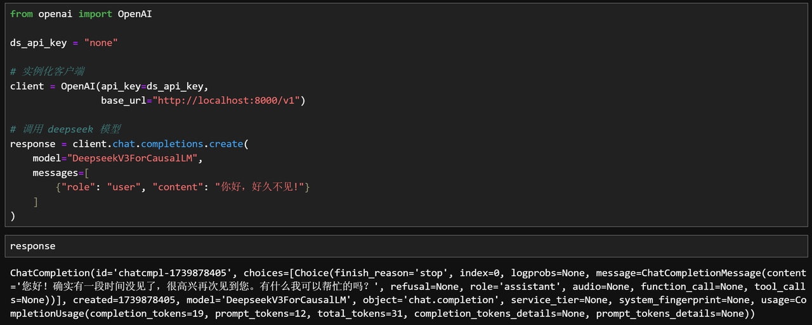

&#x20;

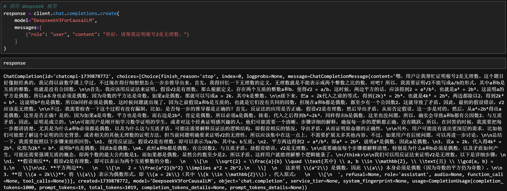

## 五、DeepSeek R1部署基础环境搭建

### 1.Open-WebUI部署流程

&#x20;       首先需要安装Open-WebUI，官网地址如下：https://github.com/open-webui/open-webui。


我们可以直接使用pip命令快速完成安装：

```bash
pip install open-webui
```


可以直接使用在GitHub项目主页上直接下载完整代码包，并上传至服务器解压缩运行：


此外，也可以在课件网盘中领取完整代码包，并上传至服务器解压缩运行：


&#x20;


在工具栏写入函数：

```python
import os
import json
import requests
from pydantic import BaseModel, Field
from typing import List, Union, Iterator

# Set DEBUG to True to enable detailed logging
DEBUG = False

class Pipe:
    class Valves(BaseModel):
        openai_API_KEY: str = Field(default="none")  # Optional API key if needed
        DEFAULT_MODEL: str = Field(default="DeepSeek-R1")  # Default model identifier

    def __init__(self):
        self.id = "DeepSeek-R1"
        self.type = "manifold"
        self.name = "KT: "
        self.valves = self.Valves(
            **{
                "openai_API_KEY": os.getenv("openai_API_KEY", "none"),
                "DEFAULT_MODEL": os.getenv("openai_DEFAULT_MODEL", "DeepSeek-R1"),
            }
        )
        # Self-hosted FastAPI server details
        self.api_url = "http://localhost:8000/v1/chat/completions"  # FastAPI server endpoint
        self.headers = {"Content-Type": "application/json"}

    def get_openai_models(self):
        """Return available models - for openai we'll return a fixed list"""
        return [{"id": "KT", "name": "DeepSeek-R1"}]

    def pipes(self) -> List[dict]:
        return self.get_openai_models()

    def pipe(self, body: dict) -> Union[str, Iterator[str]]:
        try:
            # Use default model ID since openai has a single endpoint
            model_id = self.valves.DEFAULT_MODEL

            messages = []

            # Process messages including system, user, and assistant messages
            for message in body["messages"]:
                if isinstance(message.get("content"), list):
                    # For openai, we'll join multiple content parts into a single text
                    text_parts = []
                    for content in message["content"]:
                        if content["type"] == "text":
                            text_parts.append(content["text"])
                        elif content["type"] == "image_url":
                            # openai might not support image inputs - add a note about the image
                            text_parts.append(f"[Image: {content['image_url']['url']}]")
                    messages.append(
                        {"role": message["role"], "content": " ".join(text_parts)}
                    )
                else:
                    # Handle simple text messages
                    messages.append(
                        {"role": message["role"], "content": message["content"]}
                    )

            if DEBUG:
                print("FastAPI API request:")
                print("  Model:", model_id)
                print("  Messages:", json.dumps(messages, indent=2))

            # Prepare the API call parameters
            payload = {
                "model": model_id,
                "messages": messages,
                "temperature": body.get("temperature", 0.7),
                "top_p": body.get("top_p", 0.9),
                "max_tokens": body.get("max_tokens", 8192),
                "stream": body.get("stream", True),
            }

            # Add stop sequences if provided
            if body.get("stop"):
                payload["stop"] = body["stop"]

            # Sending request to local FastAPI server
            if body.get("stream", False):
                # Streaming response
                def stream_generator():
                    try:
                        response = requests.post(self.api_url, json=payload, headers=self.headers, stream=True)
                        for line in response.iter_lines():
                            if line:
                                yield line.decode("utf-8")
                    except Exception as e:
                        if DEBUG:
                            print(f"Streaming error: {e}")
                        yield f"Error during streaming: {str(e)}"

                return stream_generator()
            else:
                # Regular response
                response = requests.post(self.api_url, json=payload, headers=self.headers)
                if response.status_code == 200:
                    generated_content = response.json().get("choices", [{}])[0].get("message", {}).get("content", "")
                    return generated_content
                else:
                    return f"Error: {response.status_code}, {response.text}"

        except Exception as e:
            if DEBUG:
                print(f"Error in pipe method: {e}")
            return f"Error: {e}"

    def health_check(self) -> bool:
        """Check if the openai API (local FastAPI service) is accessible"""
        try:
            # Simple health check with a basic prompt
            response = requests.post(
                self.api_url,
                json={
                    "model": self.valves.DEFAULT_MODEL,
                    "messages": [{"role": "user", "content": "Hello"}],
                    "max_tokens": 5,
                },
                headers=self.headers,
            )
            return response.status_code == 200
        except Exception as e:
            if DEBUG:
                print(f"Health check failed: {e}")
            return False
```

即可进行调用了：

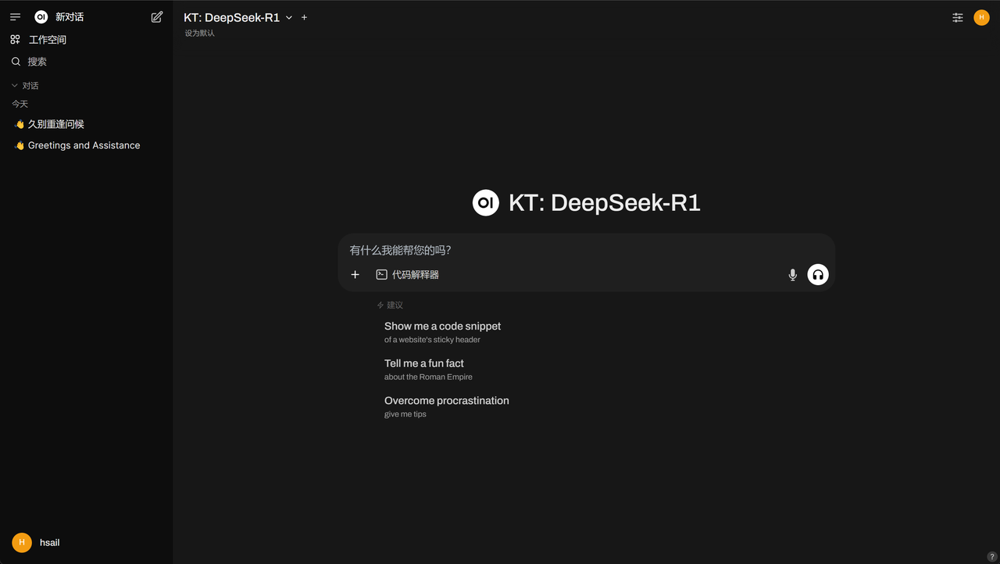

实际对话效果如下：

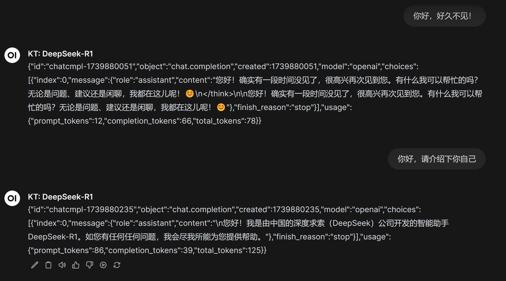
